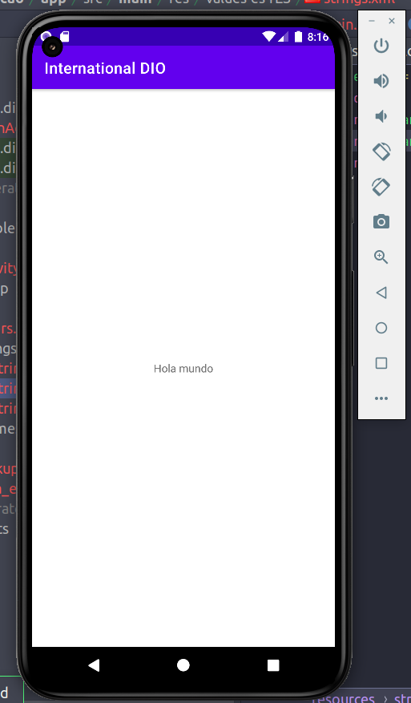
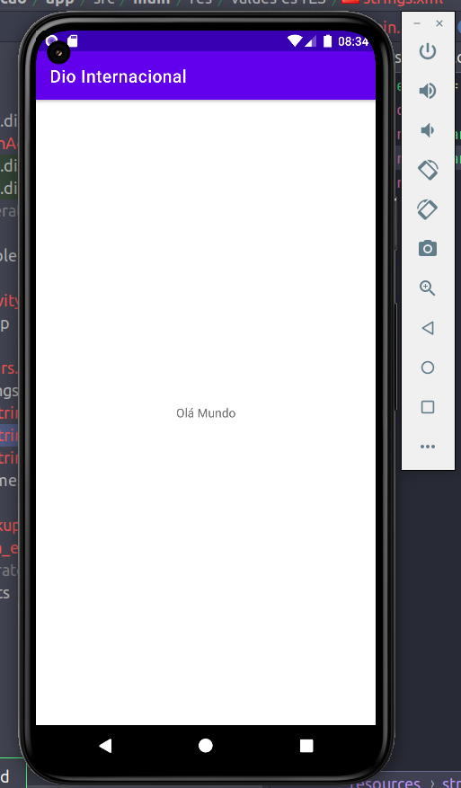

## App de Internacionalização da DIO

### Autor : [Adevan Neves Santos](https://www.linkedin.com/in/adevan-neves-santos/)

### Sobre : O app Internacionalização da DIO é o desafio de projeto que se refere a utilizar os diferentes tipos de arquivo strings.xml para a obtenção de um APP que se adapta a diferentes idiomas. O App suporta os idiomas : inglês, espanhol e português.

## 1) Inglês

## 2) Espahhol

## 3) Português

