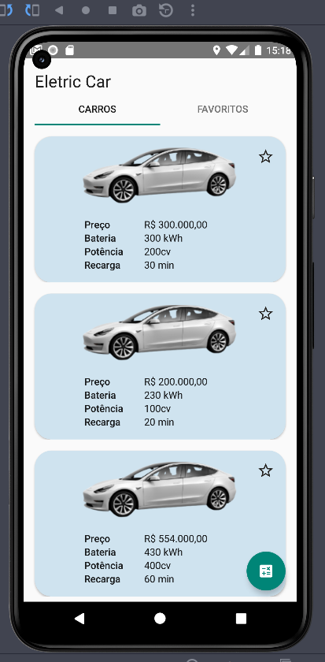

## Electric Car Digital Innovation One

### Sobre : O projeto do carro elétrico foi uma experiência completa em Desenvolvimento Android Nativo, disponibilizada na formação Android Developer da plataformda da DIO.

### Imagens de funcionamento do App:

1) Carros da API

2) Tela de cálculo de autonomia

3) Aba de favoritos, recuperados do banco de dados

